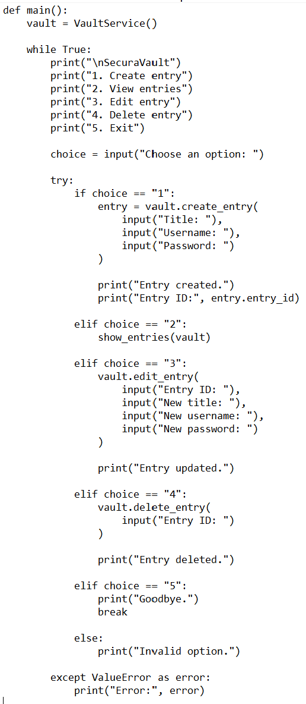
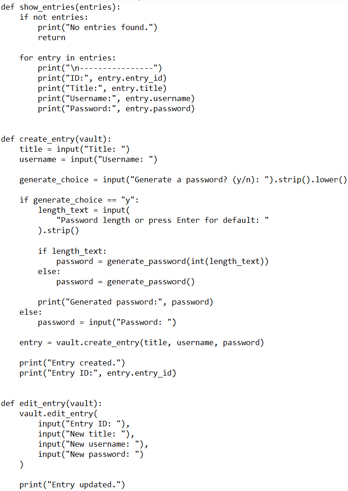
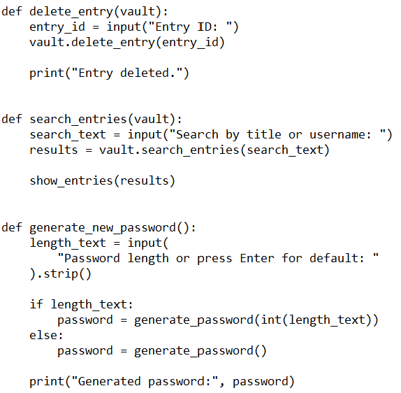
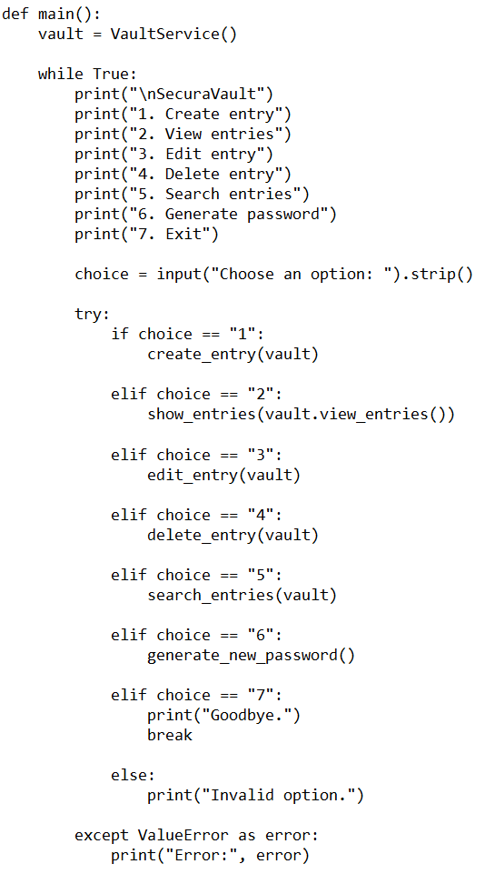
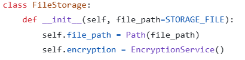
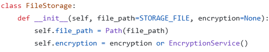
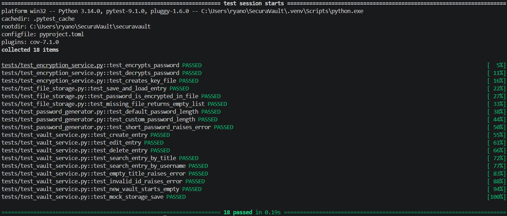

[Back to Main Doc](../../README.md)

# Refactoring

I selected two changes that improved the structure and testability of SecuraVault without changing its existing behaviour.

## Refactoring 1 — Extracting CLI Functions

### Original Code

The first version of the CLI handled most user choices directly inside the `main()` function.

Original version: [Original CLI code](https://github.com/RyanSims67/SecuraVault/blob/feature/securavault-deploy/securavault/src/ui/cli.py)

```python
def main():
    vault = VaultService()

    while True:
        print("\nSecuraVault")
        print("1. Create entry")
        print("2. View entries")
        print("3. Edit entry")
        print("4. Delete entry")
        print("5. Exit")

        choice = input("Choose an option: ")

        try:
            if choice == "1":
                entry = vault.create_entry(
                    input("Title: "),
                    input("Username: "),
                    input("Password: ")
                )

                print("Entry created.")
                print("Entry ID:", entry.entry_id)

            elif choice == "3":
                vault.edit_entry(
                    input("Entry ID: "),
                    input("New title: "),
                    input("New username: "),
                    input("New password: ")
                )

                print("Entry updated.")

            elif choice == "4":
                vault.delete_entry(input("Entry ID: "))
                print("Entry deleted.")
```

### Problem

The `main()` function was becoming too long and was responsible for several different tasks:

- displaying the menu
- reading input
- creating entries
- editing entries
- deleting entries
- handling errors

After adding password generation and search, I realised that continuing to place everything inside `main()` would make it harder to read and maintain.

The main problem was a **long method** with too many responsibilities.

### Refactored Code

I moved the different operations into separate functions.

Refactored version: [Refactored CLI code](https://github.com/RyanSims67/SecuraVault/blob/feature/iteration-2/securavault/src/ui/cli.py)

```python
def create_entry(vault):
    title = input("Title: ")
    username = input("Username: ")
    password = input("Password: ")

    entry = vault.create_entry(
        title,
        username,
        password
    )

    print("Entry created.")
    print("Entry ID:", entry.entry_id)


def edit_entry(vault):
    vault.edit_entry(
        input("Entry ID: "),
        input("New title: "),
        input("New username: "),
        input("New password: ")
    )

    print("Entry updated.")


def delete_entry(vault):
    entry_id = input("Entry ID: ")
    vault.delete_entry(entry_id)

    print("Entry deleted.")
```

The `main()` function now mainly controls the menu:

```python
if choice == "1":
    create_entry(vault)

elif choice == "2":
    show_entries(vault.view_entries())

elif choice == "3":
    edit_entry(vault)

elif choice == "4":
    delete_entry(vault)
```

### Refactoring Used

The refactoring used was **Extract Method**.

Sections of code were moved from one long function into smaller functions with clear names.

### How It Improved the Code

This change improved the code because:

- `main()` became shorter
- each function now has one main responsibility
- the menu is easier to understand
- new options can be added without making `main()` much larger
- problems are easier to locate
- individual CLI operations can be changed separately

The create, view, edit and delete behaviour remained the same after the code was reorganised.

### Personal Experience

The main difficulty was making sure that each menu option called the correct new function.

After moving the code, I manually tested:

- creating an entry
- viewing entries
- editing an entry
- deleting an entry
- invalid menu options

I also restarted the program to confirm that the CLI still opened correctly.

### Original Code screenshot



### Refactored Code screenshot





---

## Refactoring 2 — Making File Storage Testable

### Original Code

The original `FileStorage` class always created its own `EncryptionService`.

Original version: [Original FileStorage code](https://github.com/RyanSims67/SecuraVault/blob/feature/iteration-2/securavault/src/storage/file_storage.py)

```python
class FileStorage:
    def __init__(self, file_path=STORAGE_FILE):
        self.file_path = Path(file_path)
        self.encryption = EncryptionService()
```

### Problem

This worked when using the application normally, but it became a problem when I started writing file-storage tests.

The class always created the default encryption service and used the normal key location.

This meant that a test could accidentally create or use the `data/secret.key`

I wanted the tests to use temporary files instead of touching the real key or vault data.

The storage class was too closely connected to the `EncryptionService`.

### Refactored Code

I changed the constructor so that an encryption service can be passed into the storage service when needed.

Refactored version: [Refactored FileStorage code](https://github.com/RyanSims67/SecuraVault/blob/feature/iteration-3/securavault/src/storage/file_storage.py)

```python
class FileStorage:
    def __init__(self, file_path=STORAGE_FILE, encryption=None):
        self.file_path = Path(file_path)
        self.encryption = encryption or EncryptionService()
```

The normal application can still use:

```python
storage = FileStorage()
```

But the tests can now provide temporary encryption:

```python
def create_test_storage(tmp_path):
    vault_file = tmp_path / "vault.json"
    key_file = tmp_path / "test.key"

    encryption = EncryptionService(key_file)
    storage = FileStorage(vault_file, encryption)

    return storage, vault_file
```

### Refactoring Used

The constructor was changed so that an existing dependency could be passed into the class.

The refactoring used was **dependency injection**.

Instead of forcing `FileStorage` to create one specific encryption service, the encryption service can now be provided from outside.

### How It Improved the Code

This change improved the code because:

- tests no longer use the real encryption key
- tests no longer change the real vault file
- `FileStorage` is easier to test
- temporary files can be used during testing
- storage and encryption are less tightly connected
- the normal application behaviour remains unchanged

The default value still creates `EncryptionService()`, so existing calls to `FileStorage()` continue to work.

### Problem Found During Testing

My original storage design was directly connected to the normal encryption service.

While preparing the tests, I noticed that the test could create files in the real `data` folder.

I changed the constructor and used pytest's temporary folder for both the key and JSON file.

This allowed me to test saving, loading and encryption without affecting real saved data.

### Verification

I ran the file-storage tests with:

```bash
python -m pytest tests/test_file_storage.py -v
```

I then ran the complete test suite:

```bash
python -m pytest -v
```

All tests passed after the refactoring.







---

## Issue Encountered While Verifying the Refactoring

My first pytest command failed with:

```text
ModuleNotFoundError: No module named 'src'
```

The problem happened because I ran pytest from the wrong folder.

I moved into the `securavault` folder and ran:

```bash
python -m pytest -v
```

After using the correct working directory, the tests ran successfully.

## Summary

| Refactoring                          | Problem                                                 | Improvement                                          |
| ------------------------------------ | ------------------------------------------------------- | ---------------------------------------------------- |
| Extract CLI methods                  | `main()` was long and had several responsibilities      | The CLI was split into smaller and clearer functions |
| Inject encryption into `FileStorage` | Tests could use the real encryption key and data folder | Tests can use temporary encryption and storage files |

## What I Learned

The first refactoring showed me that code can still work correctly while being difficult to read and extend.

The second refactoring showed me that classes that create all their own dependencies can be harder to test.

I also learned that tests are important during refactoring because they help confirm that the internal code changed without breaking the expected behaviour.

Using separate Git branches also allowed me to compare the original and refactored versions.
