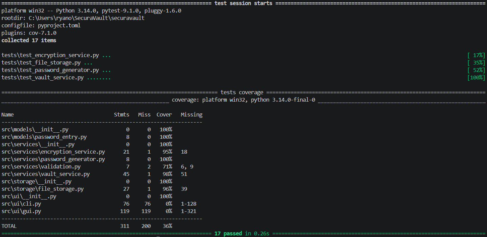

[Back to Requirements Doc](requirements.md)

# Iteration 3

Iteration 3 was developed and tested on the [`feature/iteration-3`](https://github.com/RyanSims67/SecuraVault/tree/feature/iteration-3) branch.

## Goal

The goal of Iteration 3 is to verify that the main SecuraVault features work correctly and to add basic code-quality checks.

## Related Requirements

- Q3 — Developers must be able to run automated tests for the core password manager logic.

## Specifications

| Feature | Required | Description |
|---|---|---|
| Automated unit tests | Yes | Test the main vault features and services. |
| Exception testing | Yes | Check that invalid values raise the expected errors. |
| Test coverage | Yes | Measure how much of the source code is tested. |
| Mock or test double | Yes | Test storage behaviour without changing the real vault file. |
| Code quality checks | Yes | Run tools such as Pylint on the source code. |

## Validation Plan

| Validation Check | Expected Result | Status |
|---|---|---|
| Vault service tests | Create, edit, delete and search tests pass. | Passed |
| Password generator tests | Default, custom and invalid lengths are tested. | Passed |
| Encryption tests | Passwords can be encrypted and decrypted.| Passed |
| File-storage tests | Entries can be saved and loaded safely. | Passed |
| Exception test | Invalid entry IDs raise ValueError. | Passed |
| Mock test | Storage calls are checked without using the real JSON file.| Passed |
| Test coverage | Coverage report is generated successfully.| Passed |
| Code quality check | Pylint runs successfully.| Passed with warnings |

## Screenshots

### Test Coverage

### Test encryption service

### Test file storage

### Test password generator

### Test Vault service

### Test mock - save in storage

### Pylint Test

